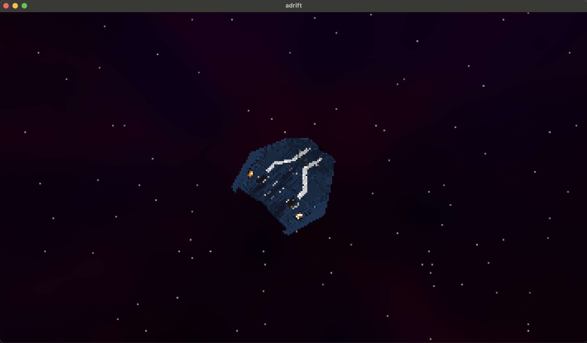

# Adrift
Space game concept written with OpenGL & C++. 3D ships and fun shaders!  
WIP, I'm continually updating as I get the time to do so.    
       

Adrift uses [my graphics library](https://github.com/collebrusco/flgl) which is based on OpenGL & glfw.

## Building
MacOS & Linux
Run ```make all``` in terminal in the repository directory. Currently this only works on MacOS, it can easily work on linux but I haven't tested it on a linux machine yet. This will download the submodules, build the submodules, & then build adrift.   

## Running
```make run``` or ```./bin/adrift```


